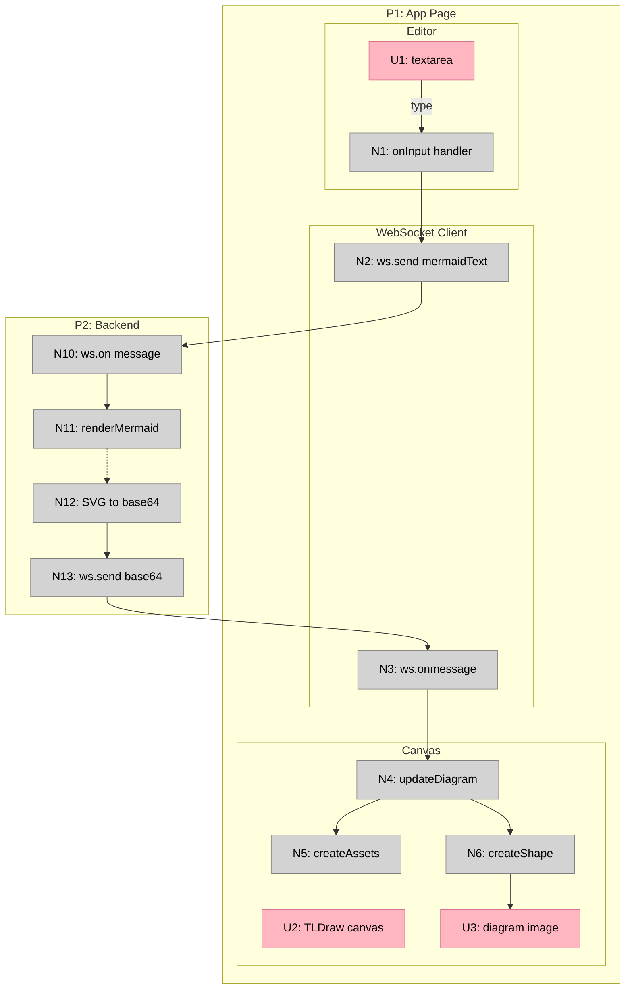

# Breadboard Canvas — Shaping Doc

An app that renders breadboard diagrams to a TLDraw whiteboard canvas, with markdown affordance tables as the source of truth.

---

## Requirements (R)

| ID | Requirement | Status |
|----|-------------|--------|
| R0 | Canvas updates live as we work | Core goal |
| R1 | Multiple shapes displayed as labeled frames on same canvas | Must-have |
| R2 | Frames stack vertically (CURRENT at top, then A, B, C...) | Must-have |

---

## Shape A: Markdown → Beautiful Mermaid → TLDraw Pipeline

| Part | Mechanism |
|------|-----------|
| **A1** | File watcher monitors markdown file for changes (chokidar or fs.watch) |
| **A2** | Extract Mermaid code blocks from markdown (regex for ```mermaid ... ```) |
| **A3** | Identify shape labels from markdown headings or Mermaid comments (CURRENT, A, B, C) |
| **A4** | Beautiful Mermaid renders each Mermaid block → SVG string |
| **A5** | Convert SVG → base64 data URL |
| **A6** | Server sends diagram data to frontend via WebSocket (for live updates) |
| **A7** | TLDraw creates frames with labels, places rendered images inside |
| **A8** | Stack frames vertically (y-position based on index) |
| **A9** | On file change: re-render changed diagrams, update TLDraw shapes in place |

**Nice-to-haves (later slices):**
- Frame summary as TLDraw text elements
- Fit check table as TLDraw text elements

---

## Fit Check

| Req | Requirement | Status | A |
|-----|-------------|--------|---|
| R0 | Canvas updates live as we work | Core goal | ✅ |
| R1 | Multiple shapes displayed as labeled frames on same canvas | Must-have | ✅ |
| R2 | Frames stack vertically (CURRENT at top, then A, B, C...) | Must-have | ✅ |

---

## Decisions

1. **Take Mermaid directly** — breadboarding skill outputs Mermaid diagrams; no need to parse affordance tables
2. **File watcher** — watch a markdown file, re-render on save
3. **Node + React** — Node server (Beautiful Mermaid + file watcher) + React frontend (TLDraw)
4. **SVG via base64 data URL** — Beautiful Mermaid outputs SVG strings; convert to base64 for TLDraw assets
5. **WebSocket for live updates** — server pushes new renders to frontend

---

## Slices

### V1 Breadboard: Live Render Loop

Before slicing, we breadboarded V1 to see all affordances:

**Places**

| # | Place | Description |
|---|-------|-------------|
| P1 | App Page | Single page with textarea and canvas |
| P2 | Backend | Node server with Beautiful Mermaid |

**UI Affordances**

| # | Place | Component | Affordance | Control | Wires Out | Returns To |
|---|-------|-----------|------------|---------|-----------|------------|
| U1 | P1 | editor | textarea | type | → N1 | — |
| U2 | P1 | canvas | TLDraw canvas | render | — | — |
| U3 | P1 | canvas | diagram image | render | — | — |

**Code Affordances**

| # | Place | Component | Affordance | Control | Wires Out | Returns To |
|---|-------|-----------|------------|---------|-----------|------------|
| N1 | P1 | editor | `onInput` handler | call | → N2 | — |
| N2 | P1 | websocket | `ws.send(mermaidText)` | call | → N10 | — |
| N3 | P1 | websocket | `ws.onmessage` | receive | → N4 | — |
| N4 | P1 | canvas | `updateDiagram(base64)` | call | → N5, → N6 | — |
| N5 | P1 | tldraw | `editor.createAssets()` | call | — | — |
| N6 | P1 | tldraw | `editor.createShape()` / `updateShapes()` | call | → U3 | — |
| N10 | P2 | server | `ws.on('message')` | receive | → N11 | — |
| N11 | P2 | render | `renderMermaid(text)` | call | — | → N12 |
| N12 | P2 | render | SVG → base64 conversion | call | → N13 | — |
| N13 | P2 | server | `ws.send(base64)` | call | → N3 | — |

### V1: Live Render Loop



---

### V1 Slicing

Breadboarding revealed the data dependency: N12's output format determines what N5 needs. So we build the producer (Beautiful Mermaid) before the consumer (TLDraw).

| Slice | Demo | Affordances |
|-------|------|-------------|
| **V1a** | Beautiful Mermaid renders Mermaid → base64 SVG (HTTP endpoint) | N11, N12 |
| **V1b** | TLDraw displays image fetched from V1a | U2, U3, N5, N6 |
| **V1c** | Type in textarea → diagram updates via WebSocket | U1, N1, N2, N3, N4, N10, N13 |

---

### V1a: Beautiful Mermaid renders

| # | Affordance | Layer |
|---|------------|-------|
| N11 | `renderMermaid(text)` | Backend |
| N12 | SVG → base64 conversion | Backend |
| — | HTTP GET endpoint returns base64 | Backend |

**Demo:** `curl localhost:3000/render?mermaid=...` returns base64 SVG.

**Dependencies:** None

---

### V1b: TLDraw displays image

| # | Affordance | Layer |
|---|------------|-------|
| U2 | TLDraw canvas | Frontend |
| U3 | diagram image | Frontend |
| N5 | `editor.createAssets()` | Frontend |
| N6 | `editor.createShape()` | Frontend |

**Demo:** App loads, fetches from V1a endpoint, displays diagram on canvas.

**Dependencies:** V1a

---

### V1c: WebSocket live loop

| # | Affordance | Layer |
|---|------------|-------|
| U1 | textarea | Frontend |
| N1 | `onInput` handler | Frontend |
| N2 | `ws.send(mermaidText)` | Frontend |
| N3 | `ws.onmessage` | Frontend |
| N4 | `updateDiagram(base64)` | Frontend |
| N10 | `ws.on('message')` | Backend |
| N13 | `ws.send(base64)` | Backend |

**Demo:** Type Mermaid in textarea → diagram updates live.

**Dependencies:** V1a, V1b

---

### V2: Load from markdown file

| # | Affordance | Layer |
|---|------------|-------|
| A2 | Extract Mermaid blocks from markdown | Backend |
| A3 | Parse shape labels from headings | Backend |

**Demo:** Point app at a markdown file, see diagram rendered.

**Dependencies:** V1c

---

### V3: File watcher

| # | Affordance | Layer |
|---|------------|-------|
| A1 | File watcher detects changes | Backend |
| A9 | TLDraw updates shapes in place | Frontend |

**Demo:** Edit markdown file, save, canvas updates without refresh.

**Dependencies:** V2

---

### V4: Frames with labels

| # | Affordance | Layer |
|---|------------|-------|
| A7 | TLDraw creates labeled frames | Frontend |
| A8 | Stack frames vertically | Frontend |

**Demo:** Multiple diagrams in file → multiple labeled frames stacked on canvas.

**Dependencies:** V3

---

## Spike Results

### Spike 1: TLDraw SDK ✅

| Question | Answer |
|----------|--------|
| **S1-Q1** Create canvas | `<Tldraw onMount={(editor) => ...} />` — React component with callback |
| **S1-Q2** Place images | Two steps: (1) `editor.createAssets([{id, type:'image', props:{src, w, h}}])` (2) `editor.createShape({type:'image', props:{assetId}})` |
| **S1-Q3** Frames with labels | `editor.createShape({type:'frame', props:{w, h, name:'Frame A'}})` |
| **S1-Q4** Reactivity | `editor.store.listen()` for changes, `editor.sideEffects.registerAfterChangeHandler()` for cascading updates |
| **S1-Q5** Update in place | Yes — `editor.updateShapes([{id, type, props}])`. Batch with `editor.batch()` for performance |

**Key pattern for image in frame:**
```tsx
// Create frame
const frameId = createShapeId()
editor.createShape({
  id: frameId,
  type: 'frame',
  x: 0, y: 0,
  props: { w: 400, h: 500, name: 'A' }
})

// Create asset from base64
const assetId = AssetRecordType.createId()
editor.createAssets([{
  id: assetId,
  type: 'image',
  props: { src: 'data:image/svg+xml;base64,...', w: 350, h: 400, mimeType: 'image/svg+xml' }
}])

// Create image shape inside frame
editor.createShape({
  type: 'image',
  x: 25, y: 50,
  parentId: frameId,  // This puts it inside the frame
  props: { assetId, w: 350, h: 400 }
})
```

---

### Spike 2: Beautiful Mermaid ✅

| Question | Answer |
|----------|--------|
| **S2-Q1** Invocation | Node API only: `import { renderMermaid } from 'beautiful-mermaid'` |
| **S2-Q2** Input | Mermaid text string directly |
| **S2-Q3** Output | SVG string (not PNG, not file) |
| **S2-Q4** Programmatic | Yes for Node.js. Limited browser support (zero DOM deps but designed for server) |

**Key pattern:**
```ts
import { renderMermaid, THEMES } from 'beautiful-mermaid'

const mermaidText = `flowchart TB
  subgraph place["PLACE: Index Page"]
    U1["U1: search input"]
  end
`

const svgString = await renderMermaid(mermaidText, THEMES.dark)
const base64 = Buffer.from(svgString).toString('base64')
const dataUrl = `data:image/svg+xml;base64,${base64}`
```
