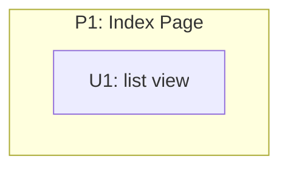
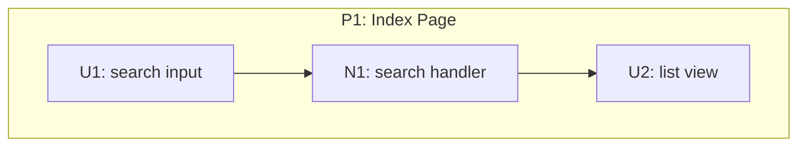
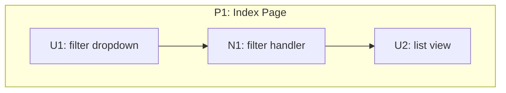

# Test Breadboard

## CURRENT: Existing System

```mermaid
flowchart TB
    subgraph P1["P1: Index Page"]
        U1["U1: list view"]
    end
```

## A: Add Search

```mermaid
flowchart TB
    subgraph P1["P1: Index Page"]
        U1["U1: search input"]
        U2["U2: list view"]
        N1["N1: search handler"]
    end
    U1 --> N1
    N1 --> U2
```

## B: Add Filters

```mermaid
flowchart TB
    subgraph P1["P1: Index Page"]
        U1["U1: filter dropdown"]
        U2["U2: list view"]
        N1["N1: filter handler"]
    end
    U1 --> N1
    N1 --> U2
```
